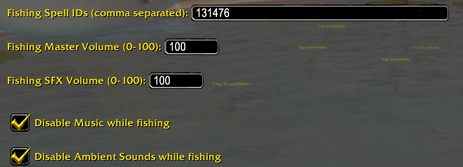

# Sounder

A fishing aid addon for **World of Warcraft**.

## The Problem

Midnight no longer exposes bobber splash events to addons, so fishing helpers that listened for the bobber sound stopped working.

## How Sounder Fixes It

Sounder watches for your fishing channel cast (spell 131476 by default). The moment the cast begins, it automatically applies your desired fishing sound settings so you can hear the bobber splash. When the cast ends, your original audio settings are automatically restored.

NOTE: This addon will not change the audio while in combat and will automatically restore audio settings when entering into combat while fishing.

## Settings

Open **Game Menu → Interface → AddOns → Sounder** to configure:

| Setting | Description |
|---|---|
| **Fishing Spell IDs (comma separated)** | Spell IDs to watch for (default: `131476`) |
| **Fishing Master Volume (0–100)** | Master Volume level applied while a cast is in progress |
| **Fishing SFX Volume (0–100)** | SFX Volume level applied while a cast is in progress |
| **Disable Music while fishing** | Disable music while a cast is in progress |
| **Disable Ambient Sounds while fishing** | Disable ambient sounds while a cast is in progress |

Settings persist across sessions via the `SounderDB` saved variable.

## Installation

1. Download or clone this repository.
2. Copy the `Sounder` folder into your `World of Warcraft/_retail_/Interface/AddOns/` directory.
3. Reload the UI or start WoW

## Source

https://github.com/weishiuchang/sounder
